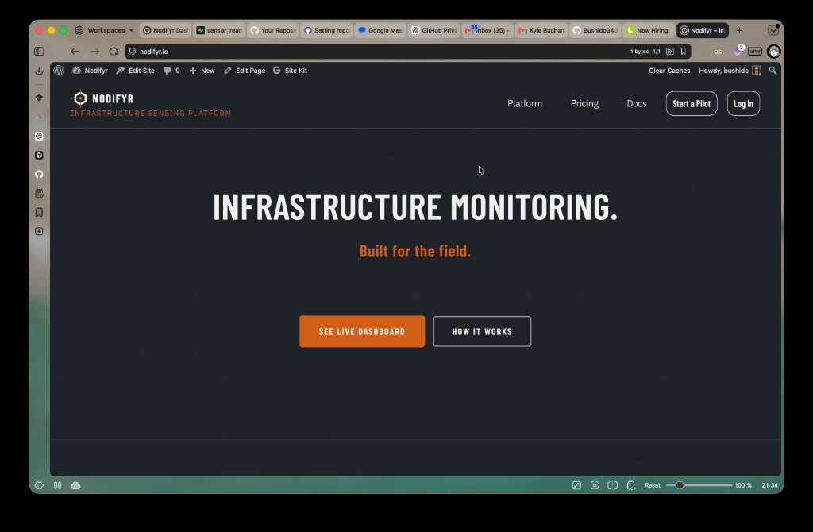
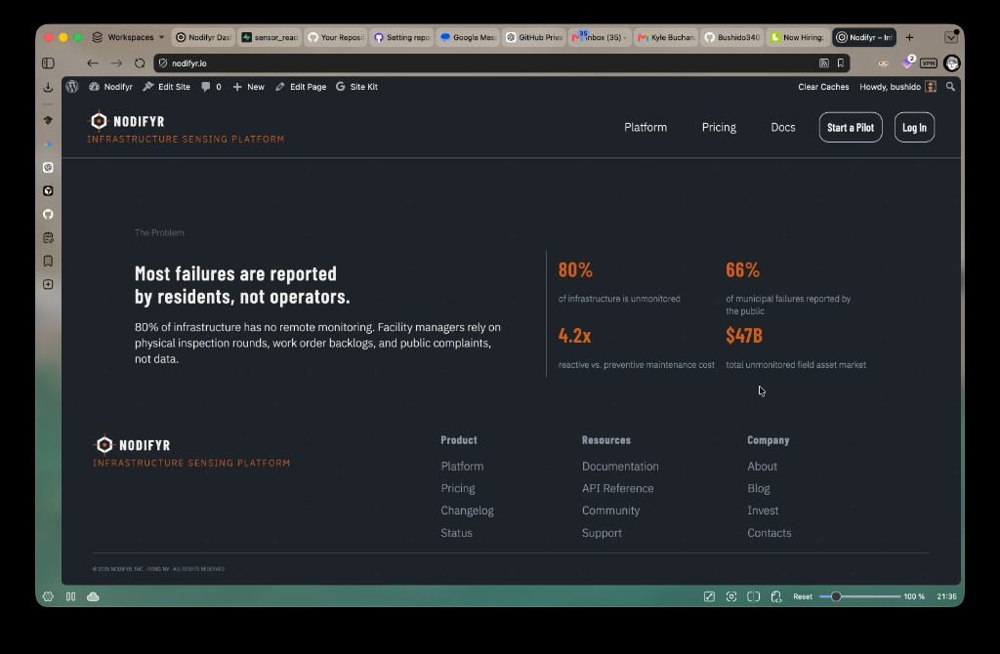
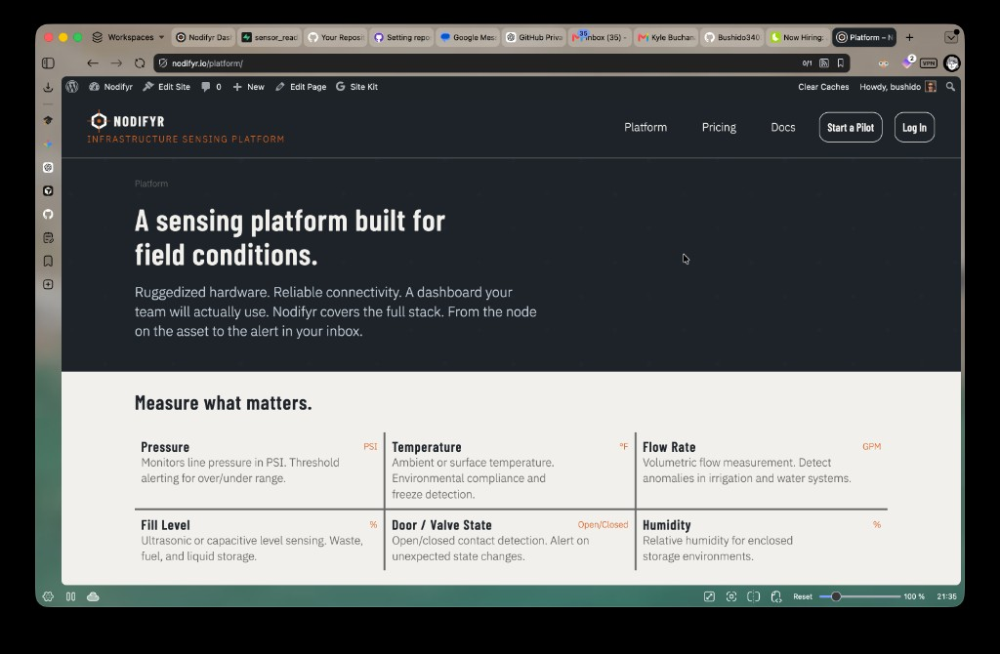

# Nodifyr — WordPress Marketing Site

**Live site:** [nodifyr.io](https://nodifyr.io)

I built and maintain the public marketing site for Nodifyr, a Reno, NV-based infrastructure
sensing company. The site runs on WordPress and serves as the primary business-facing presence
for the platform — driving pilot signups, documenting the product, and linking out to the
web application dashboard.

## What I built

| Area | Details |
|------|---------|
| **Stack** | WordPress with Full Site Editing (block-based theme) |
| **Plugins** | Google Site Kit (Analytics + Search Console), caching plugin, custom CTAs |
| **Pages** | Homepage, /platform/, /pricing/, /docs/ (links), About, Contact |
| **Design** | Custom dark-theme branding with orange accent system; responsive across desktop and mobile |
| **Layout patterns** | Hero section, stat callout blocks, feature grids, footer sitemap |
| **CTAs** | "Start a Pilot", "See Live Dashboard", "How It Works", "Log In" |

## Ongoing maintenance tasks

- Content updates and page edits as the product evolves
- Cache clearing after deployments
- Site Kit monitoring (traffic, search performance, Core Web Vitals)
- Plugin updates and compatibility checks
- Coordinating page structure with the engineering roadmap (platform links to the Next.js app)

## Business context

Nodifyr covers the full stack from hardware sensors in the field to a cloud dashboard reviewed
by facility managers. The marketing site is the top of that funnel — it explains the product,
surfaces the pricing model, and captures pilot program interest. It integrates with the
same domain infrastructure as the Next.js app (`app.nodifyr.io`) and the MkDocs technical
docs (`docs.nodifyr.io`).

## Why this matters for Cube Services

Cube Services maintains legacy WordPress systems alongside modern applications. This site
demonstrates the same mix: WordPress content management and routine upkeep, coordinated
with an actively developed backend. The workflow — edit page, test on staging, clear cache,
verify in Site Kit — maps directly to the kind of daily maintenance your team does.

## Screenshots

### Homepage — Hero

### Homepage — Problem Section

### Platform Page

> Visit [nodifyr.io](https://nodifyr.io) to see the live site. Theme source lives on the
> production host; it is not included in this repo to keep the portfolio lean.
